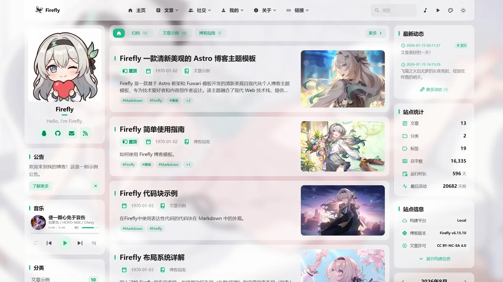

# Lonely-blog

> 基于 [Firefly](https://github.com/CuteLeaf/Firefly) 魔改的个人博客 `V6.16.8` · 在线地址：[lonelybing.top](https://lonelybing.top/)


# 页面预览

<table width="100%" align="center">
  <tr>
    <td align="center"><br>横幅模式</td>
    <td align="center"><br>全屏壁纸模式（本站默认）</td>
  </tr>
  <tr>
    <td align="center"><br>透明覆盖模式</td>
    <td align="center"><br>纯色模式</td>
  </tr>
</table>


> 主题本体是 [CuteLeaf](https://github.com/CuteLeaf) 的 [Firefly](https://github.com/CuteLeaf/Firefly)，往上追溯还有 [saicaca](https://github.com/saicaca) 的 [Fuwari](https://github.com/saicaca/fuwari)——魔改的折腾过程大多写成了[博客文章](https://lonelybing.top/)，欢迎围观喵~

## 项目概述

以 Firefly V6.16.8 为基线做的魔改版，主要改动如下：

- **胶囊导航栏**：菜单收进胶囊容器，悬停时滑动指示器平滑跟随鼠标，导航栏自带鼠标聚光灯高光，站名与按钮悬停时有圆角到胶囊形的过渡动画.
- **站名悬停资料卡**：鼠标悬停左上角站名弹出浮层卡片——头像/昵称/签名/社交链接，加当年发文贡献热力图（12 月 × 5 周，构建期按文章发布日期统计色阶），加建站以来实时运行时间（年/月/日/时/分/秒每秒刷新）与本月/今年进度条，点击头像区跳转关于页.
- **全局主题色系统**：基于 `oklch()` 色空间，通过 `siteConfig.ts` 中的 `hue` 变量控制全站配色，改一个数字即可切换整体色调（本站当前为青蓝色 hue 200）.
- **显示设置面板**：导航栏调色盘按钮打开浮层面板，运行时切换壁纸四模式（横幅 / 全屏 / 覆盖透明 / 纯色）、全屏布局（classic / hero）、文章列表列表/网格、主题色相、卡片样式与樱花特效，偏好存 localStorage，刷新不丢.
- **Material 3 动态配色**：面板里可切换 9 种配色风格（TonalSpot / Vibrant / Content / Expressive / Rainbow / Fruit Salad / Monochrome / Neutral / Fidelity）与两种配色规范（MD3 2021 / M3E 2025），HCT 色空间引擎实时重算全局主色与次色容器色；保持默认风格时站点仍是原生 oklch 观感，切了才启用 M3 配色. 配色引擎的实现借鉴自 [Shirone](https://github.com/LyraVoid/Shirone)，在此感谢 [LyraVoid](https://github.com/LyraVoid) 的开源贡献喵~
- **音乐播放器波浪进度条**：播放时正弦波涌动、暂停时缓落成直线，支持点击与拖拽 seek，配色跟随主题色. 波浪路径算法（M3 Expressive LinearWavy）借鉴自 [Shirone](https://github.com/LyraVoid/Shirone) 的 `wavy-progress` 实现.
- **背景纹理**：纯色背景模式下可叠加六层装饰纹理（无纹理 / 星芒光斑 / 极客点阵 / 流光等高线 / 几何晶体 / 落樱微瓣），SVG mask 单层实现、取色由 `--hue` 推导自动跟随主题色，三种带缓慢动画且 `prefers-reduced-motion` 下静止. 图案与动画实现借鉴自 [Shirone](https://github.com/LyraVoid/Shirone) 的 `textures.css`.
- **文章卡片蓝色细边框**：首页文章卡片带 1.5px 青蓝色边框（`oklch()` 自适应亮暗模式），增强壁纸上的视觉层次感.
- **不蒜子（Busuanzi）访问统计**：页脚全站 PV / UV，文章页单篇阅读量，以及「本站已存活 X 天 X 时 X 分 X 秒」的实时计时（自 2026.9.12 起算），全部零后端实现.
- **项目页评论区**：项目展示页接入评论系统，每个项目可在 frontmatter 用 `comment` 字段单独开关.
- **全屏随机壁纸 + 名言**：全屏壁纸模式接入多个随机图 API，每次刷新换图，底部附带随机中文名言.
- **在线写作**：配置 `.pages.yml`（Pages CMS），可在 GitHub 网页端直接写文章、发动态.
- **更新日志页**：客户端组件请求同源 `/api/commits`，由 `worker/index.js` 在服务端带上 `GITHUB_TOKEN` 回源 GitHub 拉取 commit 记录，按类型（新功能/修复/优化等）宽松分类（支持中英文 commit message 多种前缀）与分页，无需重新构建即可看到最新改动. token 只存在于服务端 Secret，前端产物里不会有凭据.
- **友链自动申请**：友链页「申请友链」按钮弹出表单（站点名称 / 链接 / 头像 / 描述），通过 Cloudflare Turnstile 人机验证后，`worker/index.js` 的 `POST /api/friend-apply` 会读取 `src/data/friends.json`、做去重与链接合法性校验，再在仓库新建分支并自动开一个 PR，站长点合并即上线，无需手动改代码. 友链数据也因此从 TS 迁移到 JSON，便于服务端读写.
- **个性化配置**：相册、打赏页、看板娘、评论区等均替换为自己的内容与账号.

顺便说一句：本文只是魔改记录，不是主题发行版. 想用原版请移步 [Firefly 仓库](https://github.com/CuteLeaf/Firefly)，使用文档在 [docs-firefly.cuteleaf.cn](https://docs-firefly.cuteleaf.cn/).

## 常用命令

| 用途 | 命令 |
|------|------|
| 安装依赖 | `pnpm install` |
| 开发服务器 | `pnpm dev` |
| 构建 | `pnpm build` |
| 预览构建产物 | `pnpm preview` |
| Astro 类型检查 | `pnpm check` |
| TypeScript 类型检查 | `pnpm type-check` |
| 格式化代码 | `pnpm format` |
| Lint + 自动修复 | `pnpm lint` |
| 新建博客文章 | `pnpm new-post <filename>` |
| 创建一条动态 | `pnpm new-d <content>` |
| 重新生成 LQIP 占位数据 | `pnpm lqips` |
| 重新生成 GitHub 仓库卡片数据 | `pnpm github-cards` |

环境要求：Node.js ≥ 22.23.0，包管理器锁定 pnpm（`preinstall` 里有 `only-allow pnpm`，用 npm/yarn 会被拦下来，别问我怎么知道的（恼））.

`pnpm build` 是一条完整流水线：先生成 GitHub 仓库卡片数据与 LQIP 占位，再走 Astro 构建，最后做看板娘资源裁剪、字体子集化、内联脚本压缩和 Pagefind 索引.

## 配置系统

所有配置集中在 `src/config/`，通过 `@/config`（barrel 文件 `index.ts` 统一导出）导入.

| 配置文件 | 职责 |
|----------|------|
| `siteConfig.ts` | 核心配置：语言、主题色、页面开关、文章列表布局、分页、分析、图片优化、字体 |
| `sidebarConfig.ts` | 侧边栏布局与组件配置 |
| `navBarConfig.ts` | 导航栏链接配置（根据页面开关动态生成） |
| `profileConfig.ts` | 用户资料：头像、昵称、签名、社交链接 |
| `backgroundWallpaper.ts` | 壁纸模式配置（本站为全屏随机图 + 名言，魔改重灾区） |
| `commentConfig.ts` | 评论系统配置（Waline/Twikoo/Giscus/Artalk/Disqus） |
| `FooterConfig.html` | 页脚 HTML 注入（本站魔改加入了不蒜子统计与存活计时） |
| `musicConfig.ts` | 音乐播放器配置（Meting API / 本地音乐） |
| `pioConfig.ts` | Live2D / Spine 看板娘配置 |
| `fontConfig.ts` | 自定义字体配置 |
| `galleryConfig.ts` | 相册配置 |
| `friendsConfig.ts` | 友链配置（数据本体在 `src/data/friends.json`，可由友链申请接口以 PR 形式追加） |
| `friendApplyConfig.ts` | 友链申请表单配置（开关 / Turnstile site key / 目标仓库与分支 / 数据文件路径） |
| `sponsorConfig.ts` | 赞赏页配置 |
| `announcementConfig.ts` | 公告栏配置 |
| `dynamicConfig.ts` | 动态页面配置（含 Memos 数据源对接） |
| `changelogConfig.ts` | 更新日志配置（GitHub 仓库 / 分支 / 分页 / Token） |
| `booknavConfig.ts` | 书签导航配置 |
| `licenseConfig.ts` | 文章许可证配置 |
| `coverImageConfig.ts` | 封面图配置 |
| `expressiveCodeConfig.ts` | 代码块渲染配置 |
| `mermaidConfig.ts` | Mermaid 图表配置 |
| `plantumlConfig.ts` | PlantUML 配置 |
| `effectsConfig.ts` | 动画特效配置 |
| `displaySettingsConfig.ts` | 显示设置面板配置 |
| `analyticsConfig.ts` | 统计分析配置 |

## 封面图与 LQIP

文章 frontmatter 的 `image` 字段支持三种形态：`src` 下的相对路径（构建期经 Astro 图片服务优化，产出多格式 `srcset`）、`/` 开头的 `public` 资源（原样引用）、远程 URL（原样引用）.

`pnpm build` 会先运行 LQIP 生成脚本（`scripts/generate-lqips.ts`）：把每张图片缩到 2×2 取角点颜色压成 18 字符 hex 存入 `src/constants/lqips.json`，渲染时解码成 CSS 渐变作占位背景，不产生额外请求. 脚本是增量的，新增或替换图片后重新构建即可，也可单独运行 `pnpm lqips`.

## 部署清单

| 检查项 | 说明 |
|--------|------|
| 托管平台 | 构建产物 `dist/` 为纯静态站点，可部署到 Vercel、Cloudflare Pages、Netlify、Nginx 等；更新日志与友链申请两个接口依赖同源 Worker，见下节 |
| 评论系统 | 本站评论区使用 Giscus，仓库指向 `Bingak/Lonely-blog`，需在 `src/config/commentConfig.ts` 中配置 |
| 访问统计 | 页脚不蒜子 PV/UV 与存活计时为零后端方案，无需部署；更细的分析可在 `siteConfig.ts` 的 analytics 中接入 |
| 内容写作 | 已配置 `.pages.yml`，可通过 Pages CMS 在 GitHub 网页端在线写作 |
| 更新日志 | 前端请求同源 `/api/commits`，由 `worker/index.js` 在服务端带上 `GITHUB_TOKEN` 回源 GitHub，并在边缘缓存（列表 5 分钟 / 单个提交 7 天） |
| 友链申请 | 前端请求同源 `POST /api/friend-apply`，需要 Worker 上配置 `TURNSTILE_SECRET_KEY` 与 `FRIEND_APPLY_GITHUB_TOKEN`，并在 Cloudflare Turnstile 控制台注册本站域名拿到 site key，详见下节 |

### 更新日志的 GitHub Token

token **不放前端**。前端产物里出现的任何凭据都是公开的（F12 就能拿走），而且 `import.meta.env.PUBLIC_*` 只会被构建期内联成字符串字面量，Cloudflare 控制台的「变量和机密」是 Worker 运行时变量，前端永远读不到。正确做法是把 token 交给 Worker：

```bash
npx wrangler secret put GITHUB_TOKEN   # 粘贴 fine-grained token（只需目标仓库的 Contents: Read）
pnpm build
npx wrangler deploy
```

未配置 `GITHUB_TOKEN` 时代理会匿名访问，限流 60 次/小时/边缘 IP；配置后为 5000 次/小时，且多访客共享边缘缓存，几乎不会回源。

### 友链申请所需凭据

三个值分属两种「环境变量」，搞混会让功能静默失效：

| 名称 | 类型 | 说明 |
|------|------|------|
| `TURNSTILE_SECRET_KEY` | Worker **运行时** Secret | 服务端调 `siteverify` 校验访客，绝不能进前端产物 |
| `FRIEND_APPLY_GITHUB_TOKEN` | Worker **运行时** Secret | fine-grained PAT，只需目标仓库的 `Contents: Read & write` + `Pull requests: Read & write` |
| `PUBLIC_TURNSTILE_SITE_KEY` | **构建时**变量 | 前端渲染 widget 用，公开值 |

```bash
npx wrangler secret put TURNSTILE_SECRET_KEY
npx wrangler secret put FRIEND_APPLY_GITHUB_TOKEN
```

两个 Secret 缺任一，接口都会返回 503 并说明缺哪个，不会静默写坏仓库.

`PUBLIC_*` 是构建时内联进产物的，配成 Worker 运行时变量前端永远读不到；而 `.env` 在 `.gitignore` 里，Workers Builds 在云端构建时读不到它——本站的兜底是把 site key（本来就是公开的）写死在 `friendApplyConfig.ts` 里，环境变量存在时仍然优先.

## 静态部署方案

`dist/` 本身仍是纯静态站点，丢给 Vercel、Netlify、Nginx 也能跑，但**更新日志与友链申请两个接口都需要同源 API**：`wrangler.jsonc` 现在指向 `worker/index.js`，只有当托管平台提供该 Worker（Cloudflare Workers）时才会带 token 回源、才会开 PR。在纯静态平台上，更新日志组件会检测到 `/api/commits` 不存在并自动回落到浏览器直连 GitHub 的匿名模式（60 次/小时/IP），而 `/api/friend-apply` 会直接 404——此时把 `friendApplyConfig.ts` 的 `enable` 关掉，友链页就不会再显示申请按钮.

## Live2D 版权声明

看板娘模型来自 B 站用户 [木果阿木果](https://space.bilibili.com/886695) 的流萤 Spine 切片数据，使用需遵守以下规则：

- 使用前必须征得作者同意
- 必须标明作者信息和来源地址
- 模型设计版权归属库洛
- 模型可用于鸣潮相关视频和直播（需标注来源）
- 禁止商用盈利，禁止二次上传转载引流

## 灵感项目

- [Firefly](https://github.com/CuteLeaf/Firefly) —— 本站使用的主题（魔改基线）
- [fuwari](https://github.com/saicaca/fuwari) —— Firefly 的上游模板
- [Shirone](https://github.com/LyraVoid/Shirone) —— Material 3 配色风格 / 配色规范动态切换、波浪进度条、背景纹理实现的来源
- [hexo-theme-shoka](https://github.com/amehime/hexo-theme-shoka)
- [astro-koharu](https://github.com/cosZone/astro-koharu)
- [Mizuki](https://github.com/matsuzaka-yuki/Mizuki)

## 许可协议

本项目遵循 [MIT license](https://mit-license.org/) 开源协议，详细查看 [LICENSE](./LICENSE) 文件.

**版权声明：**

- Copyright (c) 2024 [saicaca](https://github.com/saicaca) - [fuwari](https://github.com/saicaca/fuwari)
- Copyright (c) 2025 [CuteLeaf](https://github.com/CuteLeaf) - [Firefly](https://github.com/CuteLeaf/Firefly)
- Copyright (c) 2026 [LyraVoid](https://github.com/LyraVoid) - [Shirone](https://github.com/LyraVoid/Shirone)（移植的 Material 3 配色引擎、波浪进度条与背景纹理部分）
- Copyright (c) 2026 [LonelyBing](https://github.com/Bingak) - 本仓库的魔改部分

根据 MIT 开源协议，可自由使用、修改、分发代码，但需保留上述版权声明.
