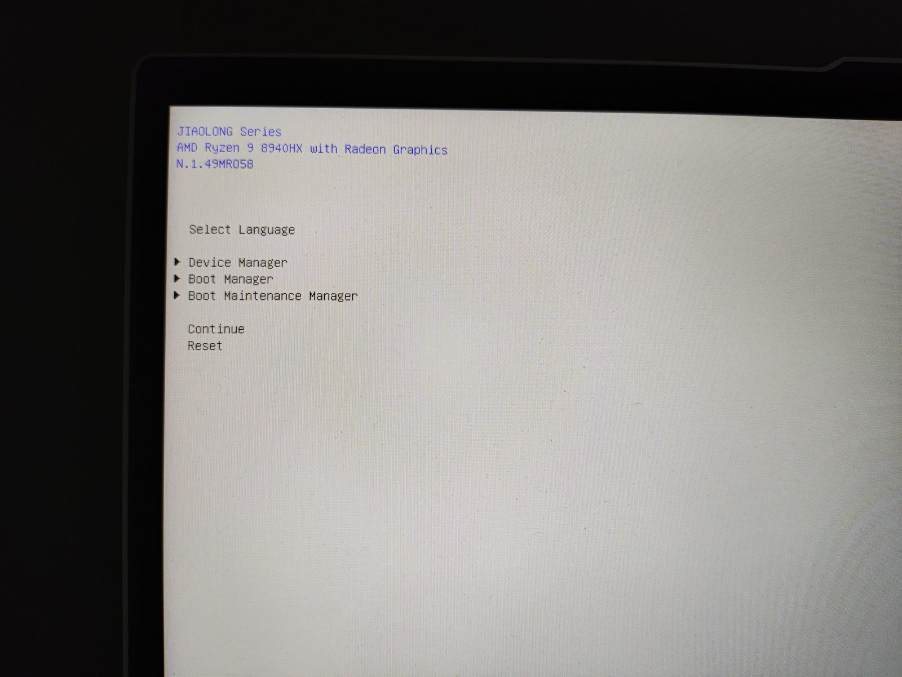
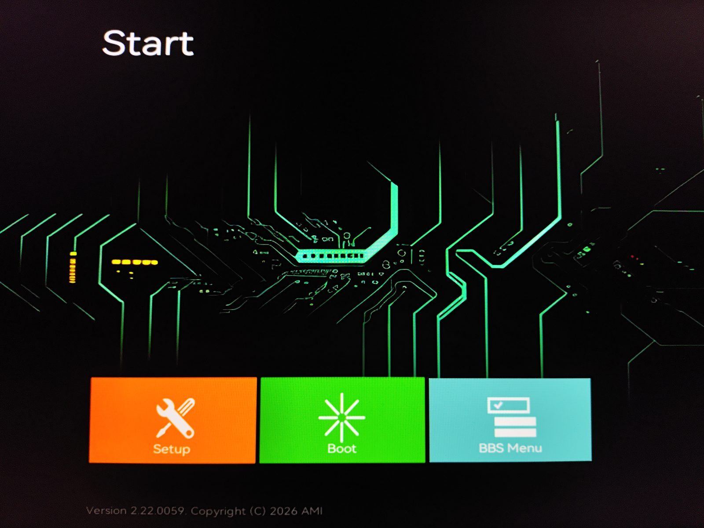
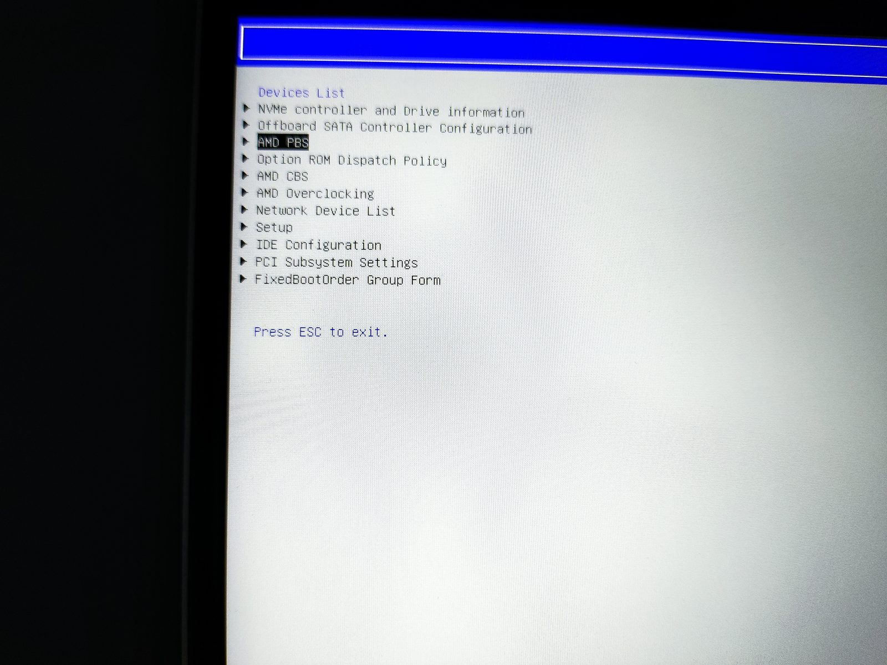
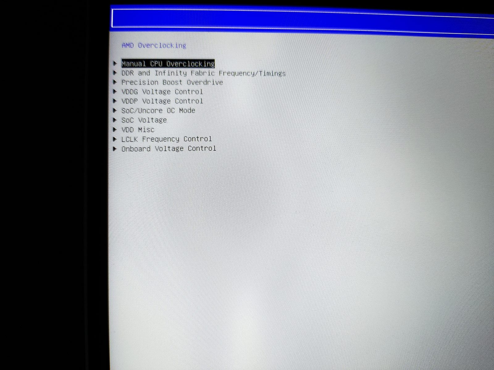
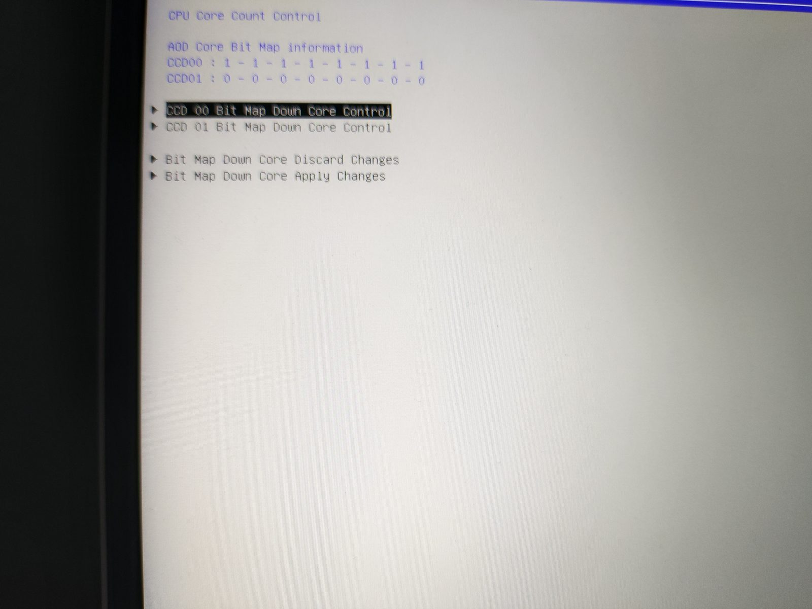
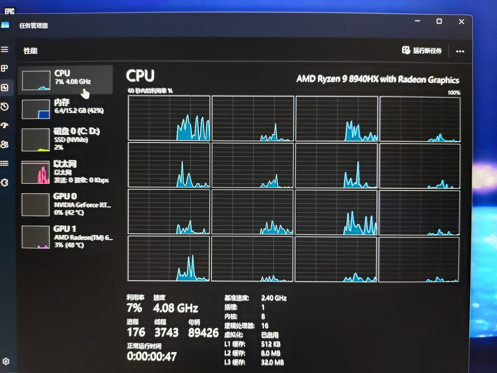
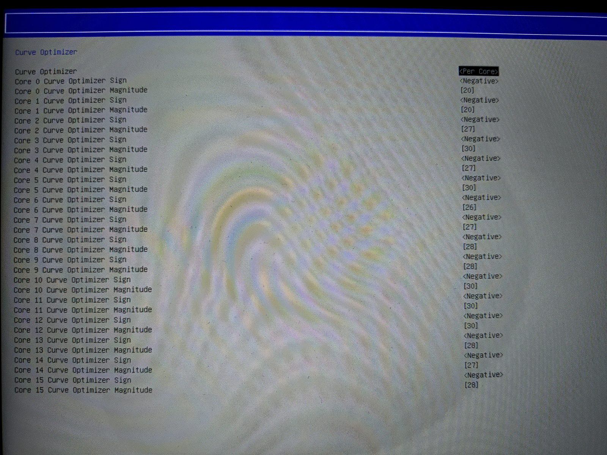
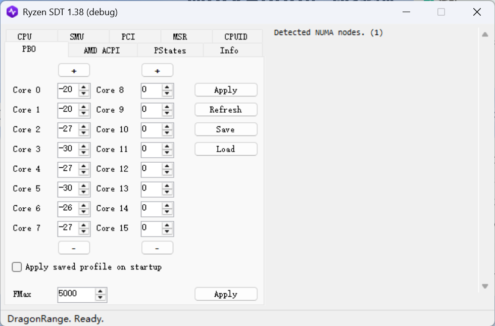
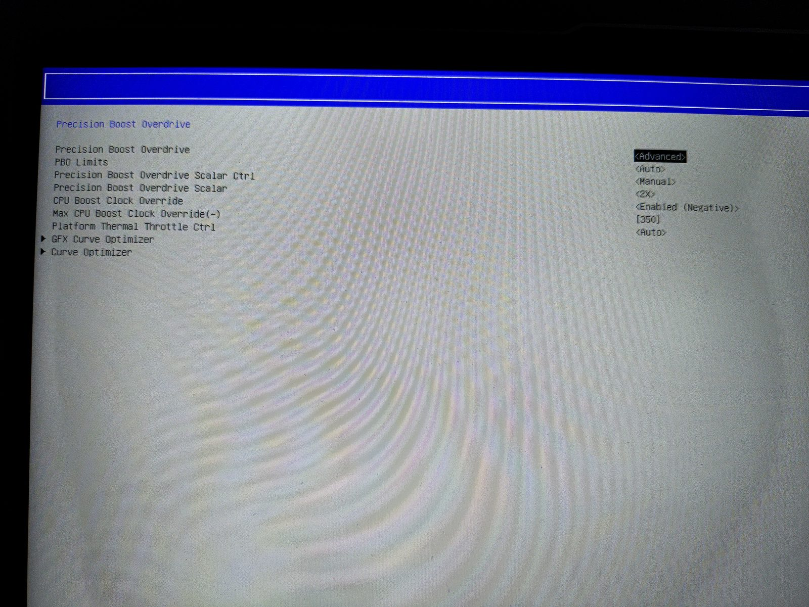
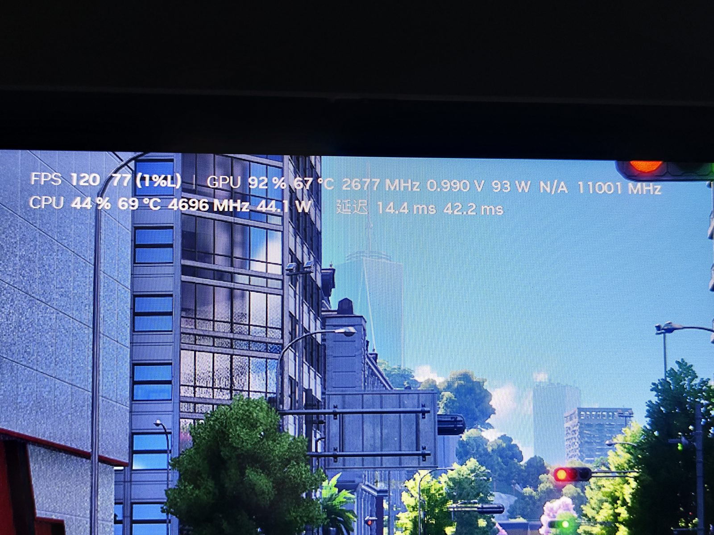

前阵子打游戏，我这本子的风扇又开始"起飞"了。

离谱的是，CPU 都 80 多度了，可那风扇转得跟要原地升空一样，整个房间都听得见。你说它热吧，是挺热；你说它不吵吧，它偏偏吵得要命。这种又热又吵的本子，折腾起来是真上头。

我这机器是 JIAOLONG 的，CPU 是 AMD Ryzen 9 8940HX，还带一张 5060。这颗 U 是 16 核 32 线程，其实是两个 CCD 拼起来的——大概理解成两坨核心，平时干活俩一起上。可游戏根本吃不满 16 核，多出来那一半基本白给，还跟着一起发热、一起催风扇。

所以我就琢磨：把其中一个 CCD 关了，剩下的再降降压、把频率压一压，能不能让风扇闭嘴、帧数还别掉太多？

先说结论吧：游戏基本无感，帧数没怎么掉，风扇是真安静了；但渲染、编译、跑分这种真吃满 16 核的活会明显变慢，需要用的时候把 CCD 开回来就成。

双 CCD 对生产力当然好，但代价也摆在那儿：要照顾两个 CCD 的供电和散热，单核、少核的加速就被压得比较保守；两个 CCD 一起发热，面积也更大，风扇自然更乐意转。

思路很简单，就三步：关掉一个 CCD，只留 8 核 16 线程；剩下那个 CCD 全核降压，同样的频率用更低的电压；再把频率和温度都压一压，别让它动不动就冲高。

## 进入 BIOS 解锁隐藏选项

最大的门槛其实在这儿：这些设置在零售 BIOS 里根本看不到，厂商图省事，把 AMD PBS / CBS / Overclocking 那些页面全藏了。

这时候就轮到 UMAF_BETA 出场了——它是个跑在 UEFI 里的小工具，能把 BIOS 里藏着的表单给你摊开，直接改里面的值。用法也简单：塞进 U 盘，进 BIOS 关掉 Secure Boot，从 U 盘启动就成。

进去一看，本来清清爽爽的 Devices List 里哗啦多出一堆东西，AMD PBS、AMD CBS、AMD Overclocking 全回来了，跟换了台机器似的。

点进 AMD Overclocking，Manual CPU Overclocking、PBO、各种电压控制、SoC / Uncore OC Mode……平时只在别人超频帖里见过的，这下全齐了。

顺便提一句，B 站那个视频 ==BV1RM816bEM4==（《全网最细的笔记本 cpu 降压定频、性能优化指南！cpu 温度暴降 20 度？！》）把流程讲得特别细，软件就放在评论区置顶。我这套思路跟它基本一致，想照着弄的可以去看一眼。它主打的就是"机器散热没问题、一打游戏就高温"这种，跟我的情况一模一样。

## 关掉一个 CCD：8 个核其实够用

重头戏之一在 CPU Core Count Control 里。AMD 给了张按位控核的"位图"，CCD00 和 CCD01 各 8 位，`1` 是开着，`0` 是关掉。

我把 CCD01 整条设成 0，只留 CCD00 那 8 个核。回到系统一看，任务管理器里"内核"老老实实变成 8、"逻辑处理器"变成 16，L3 也从 64MB 掉到 32MB。

少了 8 个核，多核跑分腰斩是肯定的，这就是前面说的"生产力除外"。但游戏压根用不满 16 核，体感几乎为零；而且只剩一个 CCD 发热，热量更集中，散热反而更省心。

这里提醒一句：别想着用 `msconfig` 或者改引导项"限核"来偷懒，那只是让系统不去调度，核心其实还通着电、还在发热。要真把整个 CCD 断电，还得在 BIOS 的位图里关。

## 降压：Curve Optimizer 才是大头

关核是减法，降压才是真正提升能效的关键。AMD 的 Curve Optimizer（CO）能让你给每个核一个电压偏移，说白了就是*同一条频率-电压曲线，整体往下挪一点*。

BIOS 里当然能直接改：

不过我更喜欢在 Windows 里用 SMUDebugTool（也叫 Ryzen SDT）调。原因很简单：调完不用重启，改一个值点一下 Apply 就能立刻验证稳不稳，试错成本低到离谱。

界面在 PBO → Curve Optimizer 那一栏，Per Core 模式，每个核一个输入框。我的取值大概在 ==−20 到 −30== 之间，按每个核的"体质"微调——体质差点的少减一档，体质好的多减一档，反正都填负值。调完记得勾上 Apply saved profile on startup，不然重启一次就白调了。

降压这东西有个甜点区：减得不够，温度没动静；减过头，轻则跑分掉、重则蓝屏重启。每调一档最好用 Core Cycler、OCCT，或者干脆跑半小时游戏验一验，稳了再继续往下压。

## 定频：把频率和温度都压一压

降压管的是电压，定频管的是频率那股"脾气"。PBO 里几个开关就是干这个的：

- **PBO Limits** 设成 Manual，自己给 PPT / TDC / EDC 定上限，别让 CPU 想当然地冲功耗
- **Max CPU Boost Clock Override** 填个负值，把最高加速频率往下压一点，断了它冲高频吃功耗的念想
- **Platform Thermal Throttle Ctrl** 从 Auto 改成手动，等于给整颗 CPU 立一道温度墙

这么一套下来，CPU 的功耗温度曲线会变得特别平，不再忽高忽低，风扇转速自然也就跟着平了，不会一会儿安静一会儿狂转。

## 实测：温度掉了，帧数几乎没动

光说没用，上数据。游戏里挂上 OSD：

CPU 大概 69°C、44W、4.7GHz 上下，GPU 67°C，帧数还能稳在 120 帧附近。跟折腾前比，温度肉眼可见降了一截，但最直观的其实是风扇——以前背景里一直"呼呼"响，现在得把耳朵凑近才听得见。

| 项目 | 折腾前 | 折腾后 |
| --- | --- | --- |
| CPU 核心数 | 16C / 32T | 8C / 16T |
| L3 缓存 | 64MB | 32MB |
| 游戏 CPU 温度 | ~80°C+，波动大 | ~69°C，平稳 |
| 游戏 CPU 功耗 | 偏高、尖峰明显 | ~44W，平稳 |
| 风扇噪音 | 明显、容易起飞 | 大幅降低 |
| 游戏帧数 | 基准 | 基本持平 |
| 多核生产力 | 基准 | 约腰斩（随时能开回来） |

## 碎碎念

折腾一圈下来，最大的感受是：笔记本的"热"和"吵"，有时候真不是一回事。很多时候 CPU 温度并不算高，只是厂商风扇策略定得太激进，或者 PBO 功耗墙放得太松，让 CPU 一有机会就往高功耗、高噪音冲。降压定频之后，功耗上限一收，同样的游戏负载，风扇转速立刻就温柔了。

当然这不代表清灰没用，恰恰相反。你这机器要是也用了两年，风扇和出风口积了灰，硬件层面的散热能力本来就被吃掉了。降压定频是在软件层面把噪音压下去，清灰是硬件层面把散热还回去，俩一块上才叫真安静。

## 工具链接

文中用到的 UMAF_BETA 和 SMUDebugTool，工具链接在这：

夸克网盘：[https://pan.quark.cn/s/ec823ad65a6f#/list/share/10fc534c8bb3465592d33cc3655e39e0](https://pan.quark.cn/s/ec823ad65a6f#/list/share/10fc534c8bb3465592d33cc3655e39e0)

记得及时清灰的效果更好哦~
