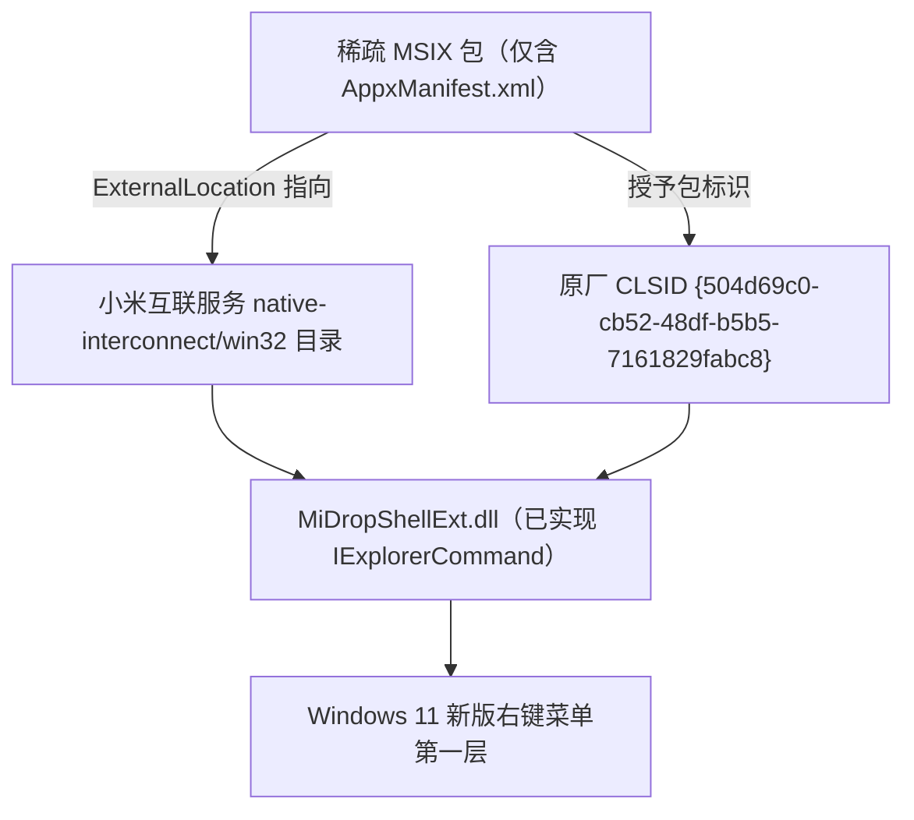

## 这玩意儿是干啥的

Win11 的右键菜单被微软拆成两层了喵~ 新版那层（就是你右键直接弹出来那个）规矩挺坑：只有拿到「包标识」（package identity）的 Shell 扩展才配站第一层，剩下的全被塞进「显示更多选项」里那个 Win10 老菜单.

离谱的是，小米互联服务那个右键处理器 `MiDropShellExt.dll` 早就把 `IExplorerCommand` 接口写好了. 论接口，它完全够格进新菜单. 可它跟着小米服务以纯 Win32 方式装的，没有包标识，于是就只能一直憋在「显示更多选项」里——明明本事够，就是没进门条（恼）.

我做的 MiDropWin11Menu 就干一件事：塞个只含 `AppxManifest.xml` 的稀疏 MSIX 包，把包标识补上. 具体是用 `-ExternalLocation` 把包的声明目录指到小米原装目录，再把标识授给原厂 CLSID `{504d69c0-cb52-48df-b5b5-7161829fabc8}`. 这样 `MiDropShellExt.dll` 就名正言顺地进到第一层了喵~

开源地址：[https://github.com/Bingak/MiDropWin11Menu](https://github.com/Bingak/MiDropWin11Menu)

::github{repo="Bingak/MiDropWin11Menu"}

顺便说一句，这东西是非官方的，跟小米半毛钱关系没有. 它不包含、不修改、也不重新分发任何小米的二进制文件，放心喵~

## 它是咋工作的

核心就一句话：给人家写好的原厂扩展补个包标识，而不是自己重写一个扩展（作者懒得写，也写不过人家，乐）.



这么干好处挺明显的：

- 原厂 DLL 原封不动，一行业务代码都不用写
- 不用给小米的二进制打补丁，也不用重新分发它
- 系统全局设置没动，右键菜单不会退回 Win10 那种旧样式

## 有啥特点

- 复用原厂 DLL：不写代码、不打补丁、不重新分发小米二进制
- 不污染原厂注册表：`HKLM\SOFTWARE\Classes` 下的原厂键值一个不动，旧菜单入口完全不受影响
- 不回退旧菜单：不把右键菜单改回 Win10 样式，也不碰系统全局行为
- 两条安装路线：路线 B（签名 `.msix`，推荐，不动全局开关）和路线 A（免 SDK 松散文件注册，得开开发人员模式）
- 配套齐全：备份、回滚、只读体检脚本，外加还原原厂注册表的 `.reg` 文件都给了
- 安全中心自动恢复：装的时候临时关掉 Windows 安全中心实时防护，脚本跑完自动精确恢复
- 卸载只清自己的：注册表清理只针对非原厂来源的 `MiDropExtMenu` 键，原厂入口一律留着
- 行为跟原厂一致：支持单文件、多选和文件夹（在空白处右键不生效，跟原厂旧菜单一个样）

## 得先准备啥

| 项目 | 要求 |
| --- | --- |
| 操作系统 | Windows 11（内部版本 ≥ **22000**），**64 位** |
| 前置软件 | 已安装「小米互联服务」，目录形如 `C:\Program Files\MI\HyperConnect\<版本>\resources\native-interconnect\win32` |
| 路线 B 额外要求 | Windows SDK（提供 `MakeAppx` / `SignTool` 签名工具） |
| 路线 A 额外要求 | 已开启 Windows 开发人员模式 |

我实测的环境是 Windows 11 25H2（26200.9168）x64 + 小米互联服务 2.0.1.452.

## 怎么装

### 方式一：一键安装（新手推荐）

仓库下载下来，双击 `一键安装.cmd`，脚本自己提权然后弹个菜单出来：

```text
[1] 路线 B 安装（签名，需 Windows SDK）
[2] 路线 A 安装（免 SDK，需开发人员模式）
[3] 体验一下（注册后测试，回车自动还原）
[4] 彻底删除
[5] 查看当前状态
[0] 退出
```

只想先瞅瞅效果的话，选 `[3]` 体验一下就行：注册完立马能试新菜单，回车自动还原，不留一点痕迹. 很适合我这种手痒又怕搞坏系统的（乐）喵~

### 方式二：命令行安装

#### 路线 B：签名安装（推荐）

这条路不用动任何系统全局开关，干净：

```powershell
# 安装 Windows SDK
winget install --id Microsoft.WindowsSDK.10.0.26100 --accept-package-agreements

# 执行签名安装脚本
powershell -ExecutionPolicy Bypass -File .\Install-RouteB-SignedMsix.ps1
```

#### 路线 A：免 SDK 安装（得开开发人员模式）

```powershell
powershell -ExecutionPolicy Bypass -File .\Install-RouteA-DevMode.ps1 -EnableDeveloperMode
```

提醒一下，路线 A 要开开发人员模式，会放宽一些系统安全策略. 没啥特殊理由，还是优先选路线 B 吧喵~

### 验证是否生效

安装脚本跑完会自动重启 `explorer.exe`. 然后你右键一个文件，新版菜单第一层就该冒出 ==使用小米互传发送== 了.


要是没出现，注销再重新登录一次就好.

### 体检和卸载

```powershell
# 只读体检，不做任何修改
powershell -ExecutionPolicy Bypass -File .\Diagnose.ps1

# 完整回滚
powershell -ExecutionPolicy Bypass -File .\Uninstall.ps1
```

`Uninstall.ps1` 还支持这些可选开关：

| 开关 | 作用 |
| --- | --- |
| `-KeepBackup` | 保留安装前生成的备份 |
| `-KeepDeveloperMode` | 保留开发人员模式设置 |
| `-KeepSdk` | 保留 Windows SDK |
| `-NoRestartExplorer` | 不自动重启资源管理器 |
| `-PurgeRegistryVerbs` | 一并清理注册表动词项 |
| `-KeepRegistryVerbs` | 保留注册表动词项 |

## 翻车了能退回来不

改 Shell 扩展这事吧，说心里没底是假的（其实是真没底）. 所以我在「能退回去」这块下了不少功夫喵~

- 安装前自动备份现有状态，卸载脚本据此完整回滚
- 卸载时只清脚本自己新增的非原厂 `MiDropExtMenu` 键，原厂注册表项一律不动
- 仓库里给了还原原厂注册表的 `.reg` 文件，随时能手动恢复
- 全程不改 `HKLM\SOFTWARE\Classes` 下的原厂键值，就算方案翻车了，原来那个「显示更多选项」入口也还在

## 许可证

脚本、清单和文档都按 MIT 授权（看仓库里的 `LICENSE` 文件就行）.

最后再啰嗦一句：这项目不包含、不修改、也不重新分发小米的任何二进制文件，纯属非官方作品，跟小米公司没啥关系，别找我（恼）喵~
