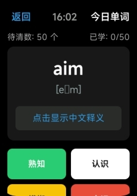

## 项目是啥

MiBand-Daily-Word-Practice 是个跑在小米手环 9 Pro 上的每日背单词小程序. 它把「墨墨背单词」最核心的思路——让记忆越模糊的单词出现得越频繁——搬到了腕上这块小屏幕里，让你没带手机的时候也能刷两下单词喵~

开源地址：[https://github.com/Bingak/MiBand-Daily-Word-Practice](https://github.com/Bingak/MiBand-Daily-Word-Practice)

开发文档 / 使用说明：[Vela 快应用开发指南](https://iot.mi.com/vela/quickapp/zh/guide/)

爱发电：[https://ifdian.net/a/LonelyBing](https://ifdian.net/a/LonelyBing)

::github{repo="Bingak/MiBand-Daily-Word-Practice"}

这项目为啥会诞生，理由其实挺朴素的：高中三年，这块 9 Pro 有一年半都在打台球和斗地主，是时候让它干点正事了. 我之前完全没碰过前端，为了把它写出来是现学 HTML / CSS / JS 的；设计灵感就直接来自高中一直在用、却因为不能带手机而在校园里真正用不起来的墨墨背单词.



顺便说一句，内置词表塞了不少单词汉译和短语，词库文件体积差不多 ==6MB== 那么大. 手环存储要是本来就紧巴巴的，建议先清出点空间再装，不然容易翻车喵~

## 技术上的事

- 运行平台：小米手环 9 Pro，基于小米 Vela 快应用（Quick App）框架
- 技术栈：用 JavaScript 写业务逻辑，界面是类 HTML / CSS 的组件描述，整体零后端依赖
- 开发工具：用 AIoT IDE 编译、调试、装机
- 数据存储：词库和学习进度全存在设备本地，背诵过程不用联网

## 核心功能

### 四档记忆状态

每个单词复习的时候，你能给四种反馈. 选哪一档，基本就决定了它以后出场的频率：

| 状态 | 颜色 | 含义 | 后续行为 |
| --- | --- | --- | --- |
| 熟知 | 🟢 绿色 | 这个词已经是我兄弟了 | **今后练习中不再出现** |
| 认识 | ⚪ 白色 | 见过面，不算熟 | 计入待练习，当天重复 **3 次** |
| 模糊 | 🟡 黄色 | 似曾相识，但不确定 | 计入待练习，当天重复 **5 次** |
| 忘记 | 🔴 红色 | 对不起，我们第一次见 | 计入待练习，当天重复 **7 次** |

### 每天抽词和间隔重复

- 除了「熟知」，剩下所有单词统一丢进「待练习单词」池子
- 每天从池子里随机抽 50 个出来，当今天的任务
- 当天反复出现的次数按记忆状态分（认识 3 次 / 模糊 5 次 / 忘记 7 次），越生疏的单词被"折磨"得越狠
- 一旦标成熟知，这词就彻底退出练习队列，不再占你时间

### 复习和学习统计

除了当天的任务，还带个复习功能，能回看近 7 日学习统计. *数据不会骗人*——你到底坚没坚持，一眼就看得出来（悲）.

### 界面挺简洁的

UI 走的极简路线，没什么花哨动效. 理由也很诚实：作者懒得加（乐）喵~

## 词库和数据格式

小程序内置高中 6200 词汇表（默认词库）. 词库文件 `words.js` 里每一项都是三段式结构：

```js
{
  "english": "terrible",
  "phonetic": "[ˈterəbl]",
  "chinese": "a. 可怕的 | 糟糕的，差劲的 | feel terrible 感觉很难受 | terrible mistake 严重的错误"
}
```

| 字段 | 说明 |
| --- | --- |
| `english` | 英文单词 |
| `phonetic` | 音标 |
| `chinese` | 释义，多个义项与短语之间用 `\|` 分隔 |

顺便说一句，要是想换成自己的词表（四六级、考研、雅思什么的），只要保持上面这个三段式结构去替换 `words.js` 就行. 有定制需求也可以直接找作者聊聊.

## 怎么用

### 先准备这些

1. 准备一台小米手环 9 Pro，确保存储空间够
2. 电脑上装个 AIoT IDE
3. 参考官方文档熟悉下 Vela 快应用的工程结构和调试流程：[https://iot.mi.com/vela/quickapp/zh/guide/](https://iot.mi.com/vela/quickapp/zh/guide/)

### 编译和安装

```bash
# 1. 克隆仓库
git clone https://github.com/Bingak/MiBand-Daily-Word-Practice.git

# 2. 用 AIoT IDE 打开工程目录
# 3. 连接手环，执行编译并在设备上安装运行
```

### 平时怎么用

1. 打开小程序，进当天的练习，系统自动从「待练习单词」里抽 50 个
2. 一个个答，按记忆实况选 熟知 / 认识 / 模糊 / 忘记
3. 生词会被反复问好几轮，直到当天任务做完
4. 有空翻翻近 7 日学习统计，看看自己有没有偷懒

## 说明和反馈

- 更新节奏看作者的驾照练习进度（恼），不过只要有空就会接着维护
- 目前作者自己也在拿这小程序备考，有问题或建议欢迎来聊：**LonelyBing@outlook.com**
- 觉得有用的话，可以去 [爱发电](https://ifdian.net/a/LonelyBing) 支持一下

希望大家都能考出好成绩！！喵~
