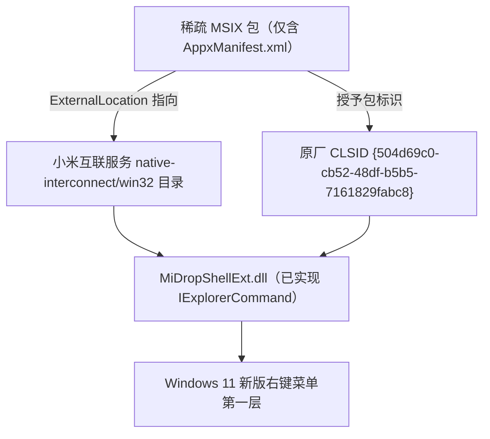
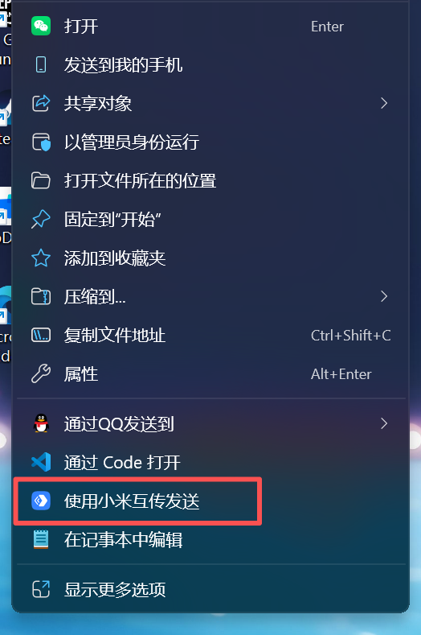

## 🌟 项目概述

Windows 11 把右键菜单拆成了两层：**新版第一层只显示已获得「包标识」（package identity）的 Shell 扩展**，其余的一律被折叠进「显示更多选项」里那个 Win10 时代的旧菜单。

小米互联服务的右键处理器 `MiDropShellExt.dll` 其实**早已实现了 `IExplorerCommand` 接口**，从接口层面完全具备出现在新菜单里的能力——但它随小米互联服务以纯 Win32 方式安装，没有包标识，于是只能一直待在「显示更多选项」里。

**MiDropWin11Menu** 用一个**只包含 `AppxManifest.xml` 的稀疏 MSIX 包**把这个问题解决掉：用 `-ExternalLocation` 把包的声明目录指向小米原装目录，把包标识授予原厂 CLSID `{504d69c0-cb52-48df-b5b5-7161829fabc8}`。于是 `MiDropShellExt.dll` 便名正言顺地出现在 Windows 11 新版右键菜单第一层。

**⭐ 开源地址：[https://github.com/Bingak/MiDropWin11Menu](https://github.com/Bingak/MiDropWin11Menu)**

::github{repo="Bingak/MiDropWin11Menu"}

> [!NOTE]
> 本项目是非官方作品，与小米无任何关联。它不包含、不修改、不重新分发任何小米二进制文件。

## 🧠 工作原理

整套方案的核心只有一句话：**给已经写好的原厂扩展补一个包标识，而不是自己重写一个扩展。**



这样做的好处是显而易见的：

- 原厂 DLL 原封不动，**不写一行业务代码**
- 不需要给小米的二进制打补丁，也不重新分发它
- 系统全局设置不变，**右键菜单不会退回 Win10 旧版样式**

## ✨ 核心特性

- **复用原厂 DLL**：不写代码、不打补丁、不重新分发小米二进制
- **不污染原厂注册表**：不修改 `HKLM\SOFTWARE\Classes` 下任何原厂键值，旧菜单入口完全不受影响
- **不回退旧菜单**：不把右键菜单改回 Windows 10 样式，不触碰系统全局行为
- **两条安装路线**：路线 B（签名 `.msix`，推荐，不动全局开关）与路线 A（免 SDK 松散文件注册，需开启开发人员模式）
- **配套齐全**：提供备份、回滚、只读体检脚本，以及还原原厂注册表的 `.reg` 文件
- **安全中心自动恢复**：安装过程中临时关闭 Windows 安全中心实时防护，脚本结束后自动精确恢复
- **卸载只清自己的**：注册表清理仅针对非原厂来源的 `MiDropExtMenu` 键，原厂入口一律保留
- **行为与原厂一致**：支持单文件、多选与文件夹（在空白处右键不生效，与原厂旧菜单行为相同）

## 📦 环境要求

| 项目 | 要求 |
| --- | --- |
| 操作系统 | Windows 11（内部版本 ≥ **22000**），**64 位** |
| 前置软件 | 已安装「小米互联服务」，目录形如 `C:\Program Files\MI\HyperConnect\<版本>\resources\native-interconnect\win32` |
| 路线 B 额外要求 | Windows SDK（提供 `MakeAppx` / `SignTool` 签名工具） |
| 路线 A 额外要求 | 已开启 Windows 开发人员模式 |

> [!NOTE]
> 实测环境：Windows 11 25H2（26200.9168）x64 + 小米互联服务 2.0.1.452。

## 🚀 使用说明

### 方式一：一键安装（推荐新手）

下载仓库后，**双击 `一键安装.cmd`**，脚本会自动提权并弹出菜单：

```text
[1] 路线 B 安装（签名，需 Windows SDK）
[2] 路线 A 安装（免 SDK，需开发人员模式）
[3] 体验一下（注册后测试，回车自动还原）
[4] 彻底删除
[5] 查看当前状态
[0] 退出
```

如果只想先试试效果，选 `[3]` 体验一下：注册后立刻测试新菜单，回车即自动还原，不留痕迹。

### 方式二：命令行安装

#### 路线 B：签名安装（推荐）

不需要改动任何系统全局开关，比较干净：

```powershell
# 安装 Windows SDK
winget install --id Microsoft.WindowsSDK.10.0.26100 --accept-package-agreements

# 执行签名安装脚本
powershell -ExecutionPolicy Bypass -File .\Install-RouteB-SignedMsix.ps1
```

#### 路线 A：免 SDK 安装（需开发人员模式）

```powershell
powershell -ExecutionPolicy Bypass -File .\Install-RouteA-DevMode.ps1 -EnableDeveloperMode
```

> [!TIP]
> 路线 A 需要开启开发人员模式，会带来一定的系统安全策略放宽。没有特殊理由的话，优先选路线 B。

### 验证是否生效

安装脚本会在结束时**自动重启 `explorer.exe`**。随后右键一个文件，新版右键菜单**第一层**应当出现「使用小米互传发送」。



如果没出现，注销并重新登录一次即可。

### 体检与卸载

```powershell
# 只读体检，不做任何修改
powershell -ExecutionPolicy Bypass -File .\Diagnose.ps1

# 完整回滚
powershell -ExecutionPolicy Bypass -File .\Uninstall.ps1
```

`Uninstall.ps1` 支持以下可选开关：

| 开关 | 作用 |
| --- | --- |
| `-KeepBackup` | 保留安装前生成的备份 |
| `-KeepDeveloperMode` | 保留开发人员模式设置 |
| `-KeepSdk` | 保留 Windows SDK |
| `-NoRestartExplorer` | 不自动重启资源管理器 |
| `-PurgeRegistryVerbs` | 一并清理注册表动词项 |
| `-KeepRegistryVerbs` | 保留注册表动词项 |

## 🧯 安全与回滚

改动 Shell 扩展多少让人心里没底，所以项目在"可回退"上做了不少功课：

- 安装前自动**备份**现有状态，卸载脚本可据此完整回滚
- 卸载时**只清理脚本自己新增的**非原厂 `MiDropExtMenu` 键，原厂注册表项一律不动
- 仓库内提供原厂注册表还原用的 `.reg` 文件，随时可手动恢复
- 全程**不改动 `HKLM\SOFTWARE\Classes` 下的原厂键值**，即使方案失效，原来的「显示更多选项」入口也还在

## 📄 许可证

脚本、清单与文档以 **MIT** 授权（见仓库 `LICENSE` 文件）。

需要再次强调：本项目**不包含、不修改、不重新分发**小米的任何二进制文件，属于非官方作品，与小米公司无关联。
