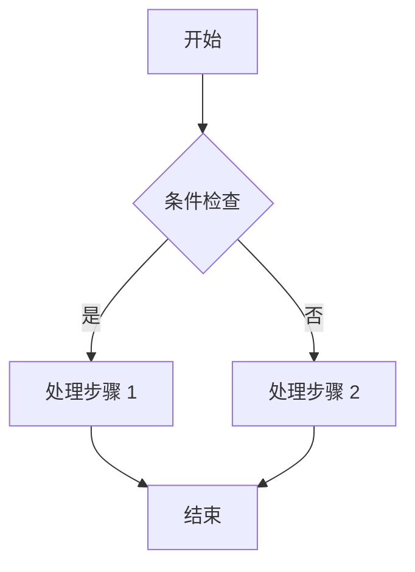

---
# ===== Firefly 文章 (posts) 模板 · Templater 版 =====
# 存放位置: src/content/posts/<文件名>.md 或 .mdx（支持子目录分组）
# 正文为 Markdown / MDX；MDX 可在顶部 import 组件并使用 JSX。
# 提示: <% tp.file.title %> 会取当前笔记文件名作为标题，建议先命名再插入模板。
title: <% tp.file.title %>
published: <% tp.date.now("YYYY-MM-DD") %>
updated: 
description: 
image: 
tags: []
category: 
draft: false
pinned: false
slug: 
lang: 
author: 
comment: true
# ---- 以下为可选字段，按需取消注释启用 ----
# series: ""          # 系列名称（同名文章自动归组，/series/ 可查看）
# seriesOrder: 1     # 系列内序号，升序排列；未设者排其后
# password: ""        # 设置后整篇 AES-256-GCM 加密，需密码查看
# passwordHint: ""    # 密码输入框上方的提示文字
# licenseName: ""     # 自定义许可证名称
# licenseUrl: ""      # 自定义许可证链接
# sourceLink: ""      # 文章来源链接
---

# <% tp.file.title %>

> [!NOTE]
> 在此撰写正文。Firefly 支持 GitHub / VitePress / Obsidian / Docusaurus 四种提醒框风格。

## 小节标题

正文内容……支持行内公式 $e^{i\pi} + 1 = 0$、代码高亮、Mermaid 图表、GitHub 仓库卡片与视频 iframe。

```js
console.log("Hello, Firefly!");
```



::github{repo="CuteLeaf/Firefly"}

## 嵌入视频（可选）

<iframe width="100%" height="468"
  src="https://www.youtube.com/embed/VIDEO_ID"
  title="YouTube video player"
  frameborder="0" allowfullscreen>
</iframe>
